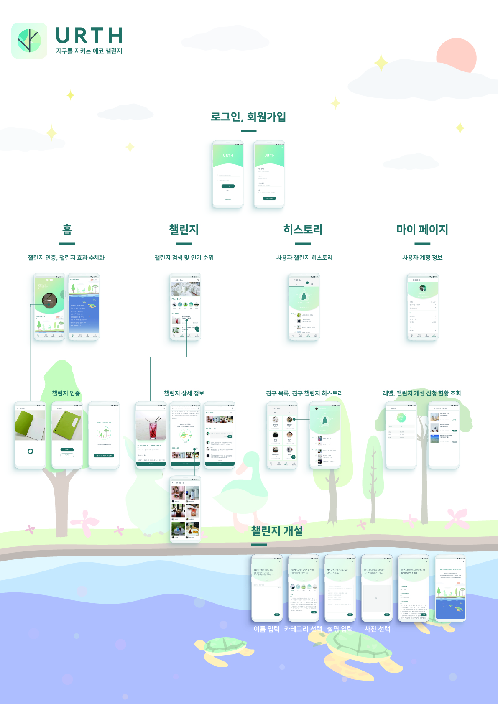

# URTH - iOS

지구를 지키는 **에코챌린지** , **URTH**

## [ About ]

어스는 '함께 사는 지구를 위한 **환경보호 플랫폼**' 입니다.

환경보호 캠페인에 크라우드 펀딩의 개념을 접목시켜 여러 사람들이 함께 환경보호를 실천하고, 여기서 축적된 데이터를 분석해주는 서비스입니다.  어스는 환경보호에 도움이 되는 행위를 챌린지로 제공하고, 사용자들이 꾸준히 환경보호를 실천할 수 있도록 도와줍니다.

*주요 기능*

- 에코챌린지 인증
- 환경보호 실천 성과 분석
- 커뮤니티

## [ WorkFlow ]             

## [ Develop Environment ]

- Language :  **Swift 5.0.1**
- iOS Depolyment Target : **12.2**

## [ Library ]

1. Server

- [Alamofire](https://github.com/Alamofire/Alamofire)
- [SwiftyJSON](https://github.com/SwiftyJSON/SwiftyJSON)
- [Kingfisher](https://github.com/onevcat/Kingfisher)

2. Layout

- [Floaty](https://github.com/kciter/Floaty)
- [MTCircularSlider](https://github.com/EranBoudjnah/MTCircularSlider)
- [TKRadarChart](https://github.com/TBXark/TKRadarChart)
- [UPCarouselFlowLayout](https://github.com/ink-spot/UPCarouselFlowLayout)
- [XLPagerTabStrip](https://github.com/xmartlabs/XLPagerTabStrip)

## [ Feature ]

- 유저

  - 로그인(o)
  - 회원가입(o)

- 홈

  - 어스 성과 요약(o)
  - 즐겨찾기 챌린지(o)
  - 즐겨찾기 챌린지 수정(x)
  - 함께하기 챌린지(o)
  - 오늘의 챌린지(o)

- 챌린지

  - 챌린지 인증(o)
  - 다른 유저들의 챌린지(o)
  - 신고하기(o)

  - 카테고리별 챌린지(o)
  - 인기 Top10 챌린지(o)
  - 검색 키워드 리스트(x)
  - 챌린지 개설(o)
  - 챌린지 검색(o)
  - 챌린지 상세보기(x)
  - 챌린지 참여(x)

- 히스토리

  - 유저 정보(o)
  - 유저 타임라인(o)
  - 친구 목록(o)
  - 친구 검색(o)
  - 친구 상세정보(x)
  - 친구 추가(o)

- 마이페이지

  - 프로필 수정(o)
  - 챌린지 개설내역(x)

